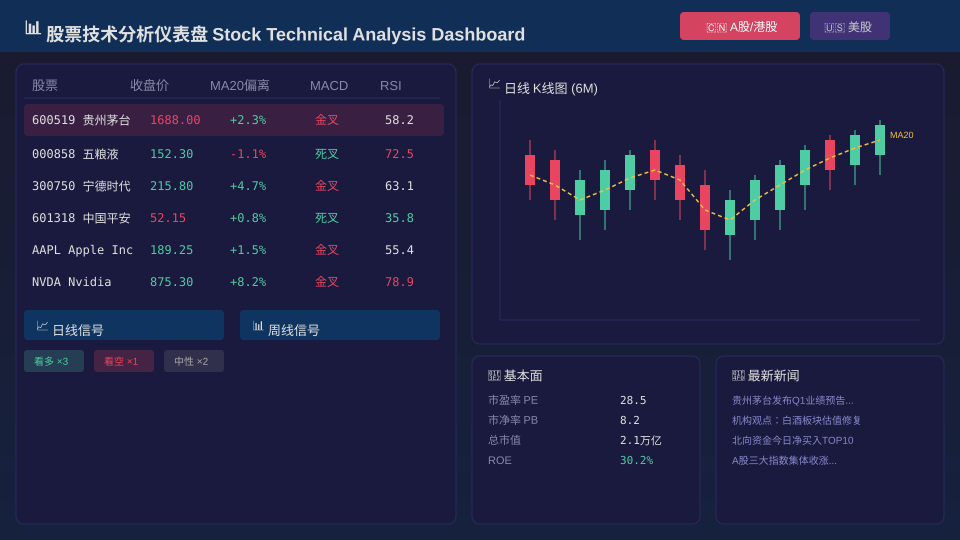
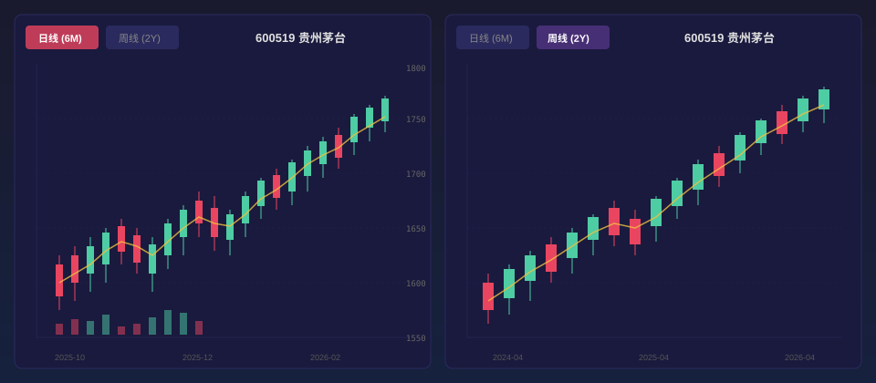

<!-- zh -->
# 股票技术分析仪表盘

> **2026-04-10** · by guoliang

> 在线体验：[https://guoliang99.github.io/stock-pages/](https://guoliang99.github.io/stock-pages/)

## 概述

这是一个覆盖 **A股、港股、美股** 三大市场的股票技术分析平台。通过 Python 后端自动化计算技术指标，生成静态数据后由前端仪表盘交互展示，无需后端服务即可部署在 GitHub Pages 上。



## 核心功能

### 多市场支持

| 市场 | 覆盖范围 | 数据周期 |
|------|----------|----------|
| 🇨🇳 A股 | 沪深主板、创业板、科创板 | 日线 + 周线 |
| 🇭🇰 港股 | 恒生指数成分股等 | 日线 + 周线 |
| 🇺🇸 美股 | 纳斯达克、NYSE 主要标的 | 日线 + 周线 |

### 技术指标分析

平台集成了多种常用技术指标：

- **MA20 偏离度**：衡量当前价格与 20 日均线的偏离程度，识别超买超卖
- **MACD**：趋势跟踪与动量指标，捕捉趋势反转信号
- **RSI**：相对强弱指标，判断市场超买（>70）或超卖（<30）状态
- **K线形态识别**：自动识别常见 K 线组合形态（锤子线、吞没形态等）

### 双周期分析

同时提供 **日线（6个月）** 和 **周线（2年）** 两个时间维度的分析视图：

- 📈 **日线信号**：捕捉短期交易机会
- 📊 **周线信号**：识别中长期趋势方向



### 交易信号生成

系统基于多个技术指标的综合评分，自动生成交易信号和评级：

- 综合多指标信号评分
- 日线与周线独立信号判断
- K线形态在不同周期的识别结果

### 基本面 & 新闻

除技术分析外，平台还整合了：

- **基本面数据**：公司核心财务指标
- **最新新闻**：相关个股的新闻资讯聚合

## 技术架构

```
┌─────────────────────────────────────────┐
│           GitHub Pages (静态托管)         │
│  ┌─────────────┐    ┌────────────────┐  │
│  │  index.html  │    │   css / js     │  │
│  │  (仪表盘UI)  │◄───│  (交互逻辑)    │  │
│  └──────┬──────┘    └────────────────┘  │
│         │ fetch                          │
│  ┌──────▼──────┐                        │
│  │  data/*.json │  ◄── build.py 生成     │
│  │  (静态数据)   │                        │
│  └─────────────┘                        │
└─────────────────────────────────────────┘
```

### 技术栈

| 层级 | 技术 | 用途 |
|------|------|------|
| 数据处理 | Python, pandas | 技术指标计算、K线形态识别 |
| 数据构建 | build.py | 扫描分析结果，生成 JSON 静态数据 |
| 前端展示 | HTML/CSS/JS | 交互式仪表盘、图表渲染 |
| 部署 | GitHub Pages | 零成本静态托管 |

## 工作流程

1. **数据获取**：通过 API 或本地脚本获取各市场行情数据
2. **指标计算**：Python 脚本计算 MA20、MACD、RSI 等技术指标
3. **形态识别**：自动识别日线与周线 K 线形态
4. **信号生成**：综合多维度指标生成交易信号与评级
5. **数据构建**：运行 `build.py` 生成前端所需的 JSON 数据
6. **发布部署**：`git push` 后 GitHub Pages 自动更新

## 后续规划

- 增加更多技术指标（布林带、KDJ、OBV 等）
- 引入机器学习模型进行信号预测
- 支持自选股列表与个性化看板
- 添加回测框架验证信号有效性

<!-- en -->
# Stock Technical Analysis Dashboard

> **2026-04-10** · by guoliang

> Live Demo: [https://guoliang99.github.io/stock-pages/](https://guoliang99.github.io/stock-pages/)

## Overview

A stock technical analysis platform covering **A-shares, Hong Kong, and US markets**. The Python backend automates technical indicator calculation and generates static data, which is then rendered by an interactive frontend dashboard — deployable on GitHub Pages with zero server cost.


## Core Features

### Multi-Market Support

| Market | Coverage | Timeframes |
|--------|----------|------------|
| 🇨🇳 A-Shares | Shanghai, Shenzhen, ChiNext, STAR | Daily + Weekly |
| 🇭🇰 HK Stocks | Hang Seng Index constituents, etc. | Daily + Weekly |
| 🇺🇸 US Stocks | Major NASDAQ & NYSE tickers | Daily + Weekly |

### Technical Indicator Analysis

The platform integrates multiple commonly used technical indicators:

- **MA20 Deviation**: Measures price deviation from the 20-day moving average to identify overbought/oversold conditions
- **MACD**: Trend-following momentum indicator for capturing trend reversals
- **RSI**: Relative Strength Index for overbought (>70) or oversold (<30) detection
- **Candlestick Pattern Recognition**: Automatic identification of common patterns (hammer, engulfing, etc.)

### Dual-Timeframe Analysis

Provides both **daily (6-month)** and **weekly (2-year)** analysis views:

- 📈 **Daily Signals**: Capture short-term trading opportunities
- 📊 **Weekly Signals**: Identify medium-to-long-term trend direction


### Trading Signal Generation

The system generates trading signals and ratings based on composite multi-indicator scoring:

- Multi-indicator composite signal scoring
- Independent signal evaluation for daily and weekly timeframes
- Candlestick pattern recognition across different periods

### Fundamentals & News

Beyond technical analysis, the platform also integrates:

- **Fundamental Data**: Core financial metrics for companies
- **Latest News**: Aggregated news for individual stocks

## Technical Architecture

```
┌─────────────────────────────────────────────┐
│         GitHub Pages (Static Hosting)        │
│  ┌──────────────┐    ┌─────────────────┐    │
│  │  index.html   │    │   css / js      │    │
│  │  (Dashboard)  │◄───│  (Interaction)  │    │
│  └──────┬───────┘    └─────────────────┘    │
│         │ fetch                               │
│  ┌──────▼───────┐                            │
│  │  data/*.json  │  ◄── Generated by build.py│
│  │ (Static Data) │                            │
│  └──────────────┘                            │
└─────────────────────────────────────────────┘
```

### Tech Stack

| Layer | Technology | Purpose |
|-------|-----------|---------|
| Data Processing | Python, pandas | Technical indicator calculation, pattern recognition |
| Data Build | build.py | Scan analysis results, generate JSON static data |
| Frontend | HTML/CSS/JS | Interactive dashboard, chart rendering |
| Deployment | GitHub Pages | Zero-cost static hosting |

## Workflow

1. **Data Acquisition**: Fetch market data via API or local scripts
2. **Indicator Calculation**: Python scripts compute MA20, MACD, RSI, etc.
3. **Pattern Recognition**: Automatically identify daily and weekly candlestick patterns
4. **Signal Generation**: Composite multi-dimensional indicators to generate signals and ratings
5. **Data Build**: Run `build.py` to generate JSON data for the frontend
6. **Publish & Deploy**: `git push` and GitHub Pages auto-updates

## Future Plans

- Add more technical indicators (Bollinger Bands, KDJ, OBV, etc.)
- Introduce ML models for signal prediction
- Support custom watchlists and personalized dashboards
- Add backtesting framework to validate signal effectiveness
