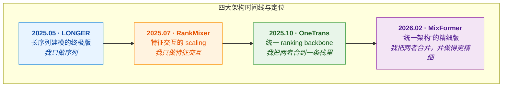
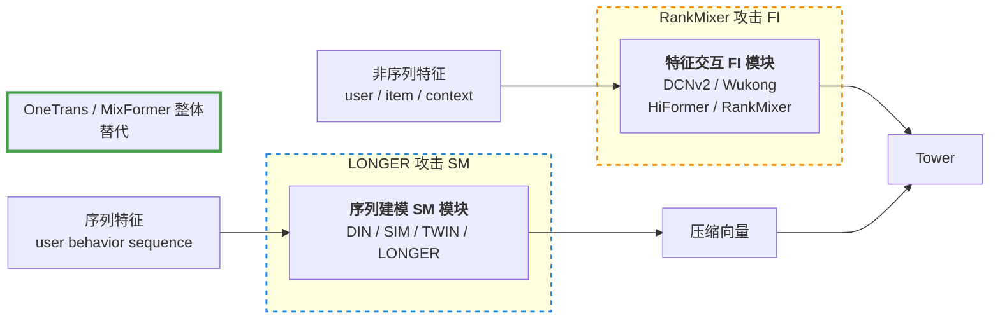
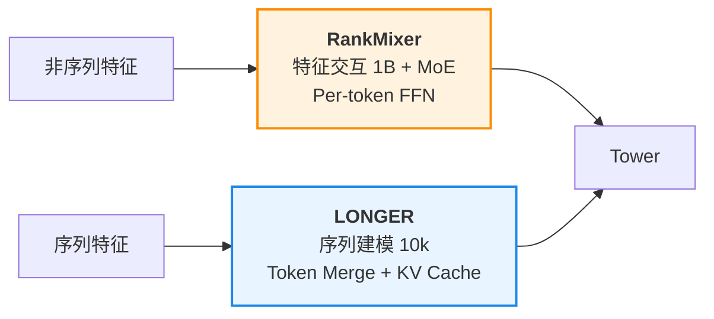
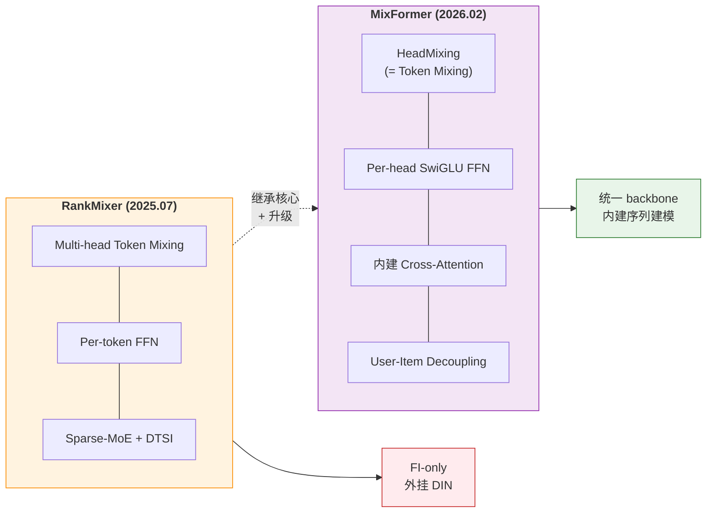
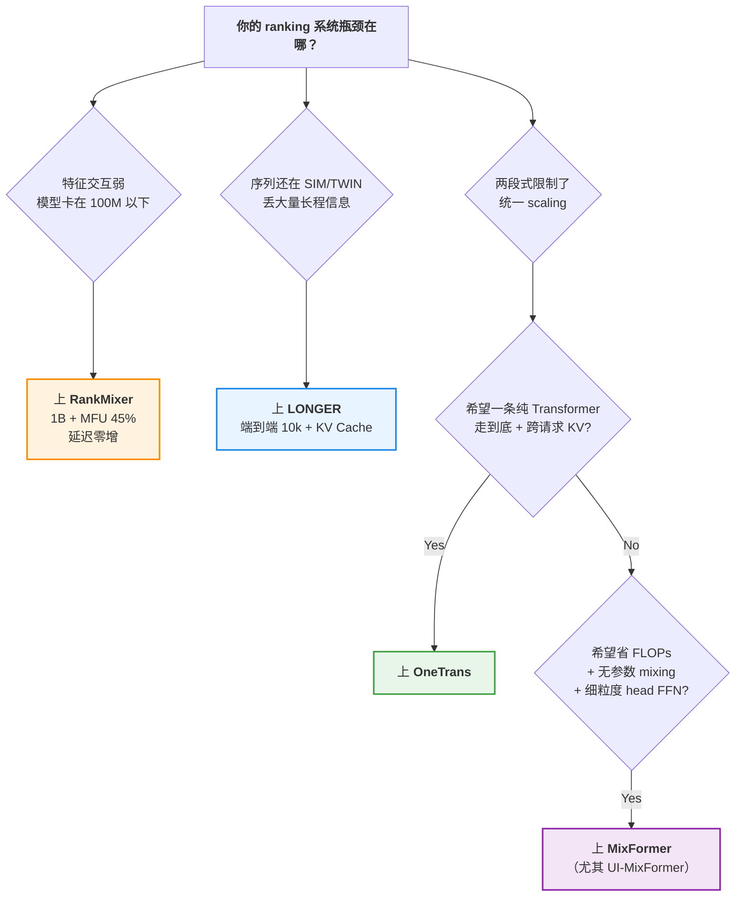

<!-- zh -->
# 字节四大工业 Ranking 架构对比

## 概述

本专题把字节跳动在 2025–2026 年间发表的四个工业 Ranking 架构——**RankMixer / LONGER / OneTrans / MixFormer**——放在同一张坐标系里对比。它们既有共同的时代背景（工业推荐进入 scaling law 时代、LLM 工程栈成熟、GPU 算力充裕），也有各自鲜明的技术立场，合在一起几乎就是字节 RecSys 的一条完整演化线。

这篇 project 的重点是**用结构图直观对比**——单看某一篇的架构图只能看到"它长什么样"，四张放一起才能看出"它为什么这么长"。

## 一图式定位

## 传统 DLRM 两段式，以及四篇论文各自攻击哪一段

传统 ranking 架构，以及四篇论文各自的攻击目标（虚线框标注）：

四篇论文的定位：

| 论文 | 攻击位置 | 是否替代整体 backbone |
|------|---------|---------------------|
| **RankMixer** | FI 模块升级版，仍和 SM 串联 | ❌ 否 |
| **LONGER**    | SM 模块升级版，仍和 FI 串联 | ❌ 否 |
| **OneTrans**  | 整个 DLRM 替换成单栈 Transformer | ✅ 是 |
| **MixFormer** | 整个 DLRM 替换成单栈 Transformer（更精细） | ✅ 是 |

**关键观察**：
- RankMixer 和 LONGER **不冲突**，可以拼成 `RankMixer + LONGER`（OneTrans 论文就把这作为最强两段式 baseline）
- OneTrans 和 MixFormer 是"统一架构"的两代实现
- MixFormer 论文把 OneTrans 作为 Parallel 范式 baseline 进行比较

## 结构图对比

### RankMixer · 特征交互侧的 scaling

**关键设计**：
- Feature Tokenization 把特征分组投影成 $T$ 个 token
- **Multi-head Token Mixing**（无参数 reshape + 转置）替代 self-attention → $O(TD)$ 复杂度
- **Per-token FFN**：每个 token 一套独立 FFN，配合 Sparse-MoE + DTSI 扩到 1B
- MFU 从 4.5% → 45%，参数扩 70× 但延迟不变

### LONGER · 序列侧的端到端 10k

**关键设计**：
- **Global Tokens**（候选表示 / CLS / UID）作为锚点前置，稳 attention、消 sink
- **Token Merge + InnerTrans**：相邻 K 个 token 合一，用小 Transformer 保组内细节
- **Hybrid Causal Attention**：第 1 层 Cross-Causal 做 query 压缩（Perceiver 风格），后续 N 层 Self-Causal 堆高阶交互
- 端到端吃 10k 序列，KV Cache Serving 让 serving 吞吐退化从 −40% 救到 −6.8%

### OneTrans · 统一 Transformer backbone

**关键设计（上图左：传统，右：OneTrans）**：
- **Unified Tokenizer**：S-tokens（序列事件）+ NS-tokens（非序列特征）拼成一条 token 序列
- **Mixed Parameterization**：S-tokens 共享一套 QKV/FFN；每个 NS-token 独享一套（同质共享 / 异质独立）
- **Pyramid Stack**：每层逐步裁剪 S-token query 数（1500 → 16）
- **Cross-Request KV Caching**：跨请求增量 $O(\Delta L)$

OneTrans Block 是一个标准的 pre-norm causal Transformer，所有 "特殊操作" 都封装在 Mixed Causal Attention 和 Mixed FFN 里（参数分段共享）。

### MixFormer · 统一架构的精细版

**关键设计**：
- **Query Mixer**（HeadMixing + Per-head SwiGLU FFN）—— RankMixer 思想在 head 维度的翻版
- **Cross-Attention**：每层用特征 head 作为 query 去序列 KV 里检索（而不是 OneTrans 那样全程 self-attn）
- **Output Fusion**：Per-head 独立 FFN 做深度融合
- **User-Item Decoupling**：方向性 mask 实现 request-level batching

**User-Item Decoupling 精髓**：user-side 计算对同一请求的所有候选共享，只需算一次；item-side 信号不能泄露到 user-side（保 cache 可复用），但 user 信号可流向 item-side。这一个方向性 mask 带来 −36% FLOPs 和 >30% 推理加速。

## 核心差异一张表

| 维度 | RankMixer | LONGER | OneTrans | MixFormer |
|------|-----------|--------|----------|-----------|
| **首要输入** | 非序列特征 | 长行为序列 | S + NS 一条序列 | 非序列 + 行为序列 |
| **替代 FI 模块** | ✅ 本身就是 FI | ❌ 外挂 | ✅ 内建 | ✅ 内建 |
| **替代 SM 模块** | ❌ 外挂 DIN | ✅ 本身就是 SM | ✅ 内建 | ✅ 内建 |
| **跨 token 交互** | Multi-head Token Mixing（无参数） | Cross + Self Causal Attention | 统一 Causal Self-Attention | HeadMixing + Cross-Attention |
| **参数共享** | Per-token 独享 FFN | 全 token 共享 | S 共享 / NS 独享 | Per-head 独享 SwiGLU |
| **长度瓶颈应对** | 不处理 | Token Merge + Recent-k query | Pyramid Stack | User-Item Decoupling |
| **扩参数主力** | Sparse-MoE + DTSI | Token Merge 的 $K^2$ 放大 | NS token-specific QKV+FFN | 宽度 + Per-head 独立 FFN |
| **KV Cache** | — | 单请求内 | 单请求 + 跨请求增量 | User-side 跨候选复用 |
| **序列最长** | — | 10k | ~1.5k（pyramid 后） | 512 → 10k |
| **离线最佳增益** | 1B 模型 Finish AUC +0.95% | +1.57% AUC vs baseline | +2.79% CTR UAUC | +1.28% Finish AUC（FLOPs −67%）|
| **线上旗舰结果** | 抖音 ADVV +3.90% | 电商 GMV/u +6.54% | Feeds GMV/u +5.68% | 抖音评论 +0.70% |

## 两两关系解读

### RankMixer vs LONGER · 一横一纵，互补不冲突

可以组合成 **RankMixer + LONGER**，OneTrans 论文里就把这个当最强两段式 baseline。

### LONGER vs OneTrans · 序列终极版 vs 整个 backbone 重构

- LONGER 接受"序列模块独立存在"的假设，把它做到 10k
- OneTrans 否定这个假设，序列 token 和非序列 token 扔进同一条 self-attn 栈
- **LONGER 的 Global Tokens ≈ OneTrans 的 NS-tokens 的雏形**——但前者是"辅助锚点 + 共享参数"，后者是"任务主体 + token-specific 参数"

### OneTrans vs MixFormer · 同一哲学的两代实现

| | OneTrans | MixFormer |
|---|---|---|
| 跨 token 交互 | Self-Attention（标准 softmax） | **HeadMixing**（无参数 reshape） |
| 长序列处理 | **Pyramid Stack**（层间裁剪 query） | **显式 Cross-Attention**（逐层读序列） |
| Token 数量 | 大（几百到 1500） | 小（$N=16$ 个 head） |
| User-Item 解耦 | Causal mask 天然解耦 | **方向性 mask** |
| FLOPs | 8.62T (OneTrans-L) | 2.24T (UI-MixFormer-medium) |

**哲学差别**：
- OneTrans 走 **纯 Transformer** 路线（所有 token 经过 self-attn）
- MixFormer 走 **MLP-Mixer + Cross-Attention 混合** 路线（无参数 mixing 省 FLOPs）

### RankMixer vs MixFormer · 血缘最近的两个

同一批作者（都包含 Zhifang Fan），MixFormer 可以看作 RankMixer 的"统一 backbone"升级版：

MixFormer ≈ RankMixer + 内建 Cross-Attention 序列建模 + User-Item Decoupling。

## 选型决策树（给工程师）

**按演化顺序**：RankMixer（FI 侧）→ LONGER（SM 侧）→ OneTrans 或 MixFormer（统一 backbone）。

## 趋势判断

字节推荐 ranking 架构的演化路径：

> **两段式各自做大（RankMixer / LONGER）→ 尝试合并（OneTrans）→ 精细合并（MixFormer）**

下一步大概率是把四者的优势合在一起：
- RankMixer 的 SMoE（参数扩展）
- LONGER 的 10k 长序列 + KV Cache
- OneTrans 的 Cross-Request KV Cache
- MixFormer 的 HeadMixing + User-Item 解耦

统一 backbone + MoE + 生成式目标 + 超长序列 的组合拳可能就是下一代工业 Ranking 的形态。

## 一句话终极对比

- **RankMixer**：非序列特征的千亿级表达力装进 1B 参数、MFU 45%。
- **LONGER**：把 10k 长序列端到端送进模型，不再绕路。
- **OneTrans**：序列和非序列本就不该分家，一条 Transformer 就够了。
- **MixFormer**：一条 Transformer 可以更精细，无参数混合 + 显式 Cross-Attn + User-Item 解耦。

## 相关资源

- **完整笔记仓库**：<https://github.com/guoliang25/cc_paper>
- **Markdown 版深度对比**：[字节四大 Ranking 架构对比](https://github.com/guoliang25/cc_paper/blob/main/paper/%E5%AF%B9%E6%AF%94/%E5%AD%97%E8%8A%82%E5%9B%9B%E5%A4%A7Ranking%E6%9E%B6%E6%9E%84%E5%AF%B9%E6%AF%94-RankMixer-LONGER-OneTrans-MixFormer.md)
- **Scaling Law 专题（配套）**：[T 与斜率截距](https://guoliang25.github.io/cc_paper/rankmixer-T-and-scaling-slope-intercept.html)
- **原始论文**：
  - RankMixer：[arXiv:2507.15551](https://arxiv.org/abs/2507.15551)
  - LONGER：[arXiv:2505.04421](https://arxiv.org/abs/2505.04421)
  - OneTrans：[arXiv:2510.26104](https://arxiv.org/abs/2510.26104)
  - MixFormer：[arXiv:2602.14110](https://arxiv.org/abs/2602.14110)

<!-- en -->
# Comparison of Four ByteDance Industrial Ranking Architectures

## Overview

This topic compares four industrial Ranking architectures published by ByteDance between 2025 and 2026 — **RankMixer / LONGER / OneTrans / MixFormer**. They share a common era (industrial recommendation entering the scaling-law age, mature LLM engineering stack, abundant GPU compute) but take distinct technical stances. Together they form an almost complete evolution line of ByteDance RecSys.

The focus of this project is **side-by-side architecture diagrams** — a single paper's figure shows "what it looks like", but four together reveal "why it looks that way".

## One-Liner Positioning

| | One-liner | Revolution target |
|---|---|---|
| **RankMixer** | Hardware-conscious Multi-head Token Mixing + Per-token FFN + Sparse-MoE, scaling FI to 1B with MFU 45% | FI module (DLRM-MLP / Wukong / HiFormer) |
| **LONGER**    | Token Merge + Hybrid Cross/Self Attention + KV Cache, end-to-end 10k sequence modeling | SM module (SIM / TWIN / UE / MIMN) |
| **OneTrans**  | Mixed Parameterization + Pyramid Stack + Cross-Request KV Cache, merging SM and FI into one Transformer stack | DLRM encode-then-interaction paradigm |
| **MixFormer** | Query Mixer + Cross-Attention + Output Fusion + User-Item Decoupling, a more refined unified architecture | OneTrans itself + other two-stage solutions |

## Architecture Diagrams

### RankMixer · Scaling the Feature-Interaction Side

### LONGER · End-to-End 10k Sequence Modeling

### OneTrans · Unified Transformer Backbone

### MixFormer · Refined Unified Architecture

## Core Differences at a Glance

| Dimension | RankMixer | LONGER | OneTrans | MixFormer |
|-----------|-----------|--------|----------|-----------|
| **Primary input** | Non-sequential features | Long behavior sequence | Unified S+NS tokens | Non-seq + behavior seq |
| **Replaces FI** | ✅ (IS the FI module) | ❌ external | ✅ built-in | ✅ built-in |
| **Replaces SM** | ❌ external DIN | ✅ (IS the SM module) | ✅ built-in | ✅ built-in |
| **Cross-token mixing** | Parameter-free Multi-head Token Mixing | Cross + Self Causal Attention | Unified Causal Self-Attention | HeadMixing + Cross-Attention |
| **Parameter sharing** | Per-token FFN | All-token shared | S shared / NS token-specific | Per-head SwiGLU |
| **Length bottleneck** | Not addressed | Token Merge + Recent-k query | Pyramid Stack | User-Item Decoupling |
| **Scaling lever** | Sparse-MoE + DTSI | Token Merge $K^2$ expansion | NS token-specific QKV+FFN | Width + Per-head FFN |
| **KV Cache** | — | Within-request | Within + cross-request incremental | User-side across candidates |
| **Max sequence** | — | 10k | ~1.5k (after pyramid) | 512 → 10k |
| **Best offline gain** | 1B Finish AUC +0.95% | +1.57% AUC vs baseline | +2.79% CTR UAUC | +1.28% Finish AUC (−67% FLOPs) |
| **Flagship online** | Douyin ADVV +3.90% | E-commerce GMV/u +6.54% | Feeds GMV/u +5.68% | Douyin comment +0.70% |

## Pairwise Relationships

**RankMixer ↔ LONGER** · Orthogonal and non-conflicting — can be composed as `RankMixer + LONGER`, used as the strongest two-stage baseline in OneTrans paper.

**LONGER ↔ OneTrans** · "Terminal sequence module" vs "entire backbone refactor". LONGER's Global Tokens are a nascent form of OneTrans's NS-tokens.

**OneTrans ↔ MixFormer** · Two generations of the same unified philosophy. OneTrans goes pure-Transformer; MixFormer goes MLP-Mixer + Cross-Attention hybrid. MixFormer achieves 2.24T FLOPs vs OneTrans-L's 8.62T.

**RankMixer ↔ MixFormer** · Closest kinship (shared authors incl. Zhifang Fan). MixFormer ≈ RankMixer + built-in sequence Cross-Attention + User-Item Decoupling.

## Selection Decision Tree

- FI module weak (stuck below 100M params) → **RankMixer** (1B + MFU 45%, zero latency increase)
- Sequence still on SIM/TWIN, losing long-range info → **LONGER** (end-to-end 10k + KV Cache)
- Two-stage architecture limits unified scaling:
  - Want "one pure Transformer all the way" + cross-request KV → **OneTrans**
  - Want FLOPs saving + parameter-free mixing + fine-grained head FFN → **MixFormer** (especially UI-MixFormer)

By evolution order: **RankMixer → LONGER → OneTrans or MixFormer**.

## Trajectory

ByteDance's ranking architecture evolution:

> **Two-stage → each maxed out (RankMixer / LONGER) → merge attempt (OneTrans) → refined merge (MixFormer)**

Next likely phase: combine all four's advantages — RankMixer's SMoE + LONGER's 10k sequence + OneTrans's Cross-Request KV Cache + MixFormer's HeadMixing & User-Item Decoupling, inside one unified backbone with generative objectives.

## Final One-Liners

- **RankMixer**: billion-scale expressiveness of non-sequential features, packed into 1B params with MFU 45%.
- **LONGER**: 10k long sequences fed end-to-end into the model, no more detours.
- **OneTrans**: sequential and non-sequential should never have been split — one Transformer is enough.
- **MixFormer**: one Transformer can be even more refined — parameter-free mixing + explicit Cross-Attention + User-Item decoupling.

## Resources

- **Full notes repo**: <https://github.com/guoliang25/cc_paper>
- **Markdown deep comparison**: [Four ByteDance Ranking Architectures](https://github.com/guoliang25/cc_paper/blob/main/paper/%E5%AF%B9%E6%AF%94/%E5%AD%97%E8%8A%82%E5%9B%9B%E5%A4%A7Ranking%E6%9E%B6%E6%9E%84%E5%AF%B9%E6%AF%94-RankMixer-LONGER-OneTrans-MixFormer.md)
- **Companion Scaling-Law topic**: [T & Slope/Intercept](https://guoliang25.github.io/cc_paper/rankmixer-T-and-scaling-slope-intercept.html)
- **Original papers**:
  - RankMixer: [arXiv:2507.15551](https://arxiv.org/abs/2507.15551)
  - LONGER: [arXiv:2505.04421](https://arxiv.org/abs/2505.04421)
  - OneTrans: [arXiv:2510.26104](https://arxiv.org/abs/2510.26104)
  - MixFormer: [arXiv:2602.14110](https://arxiv.org/abs/2602.14110)
